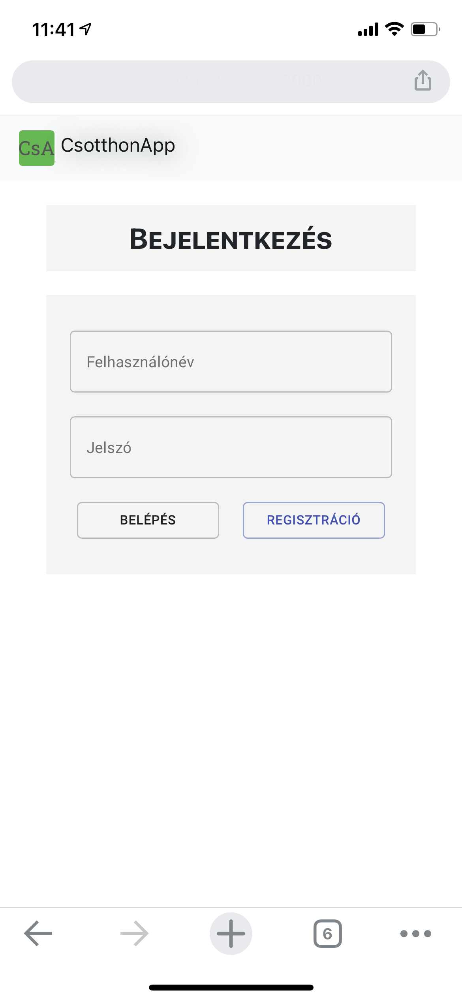
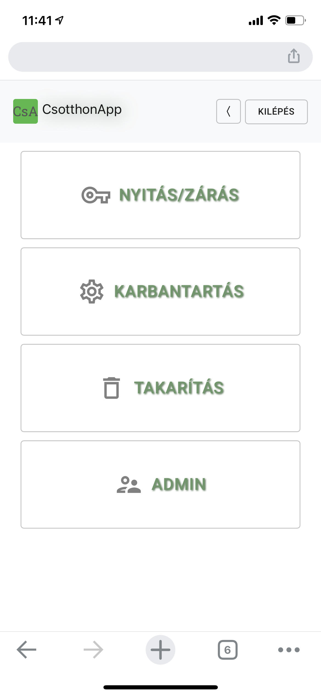
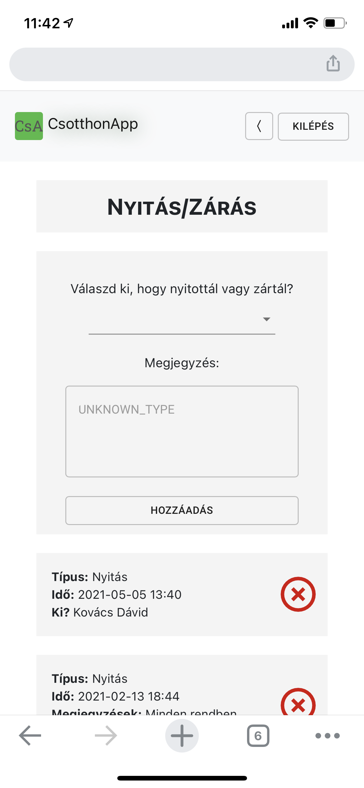
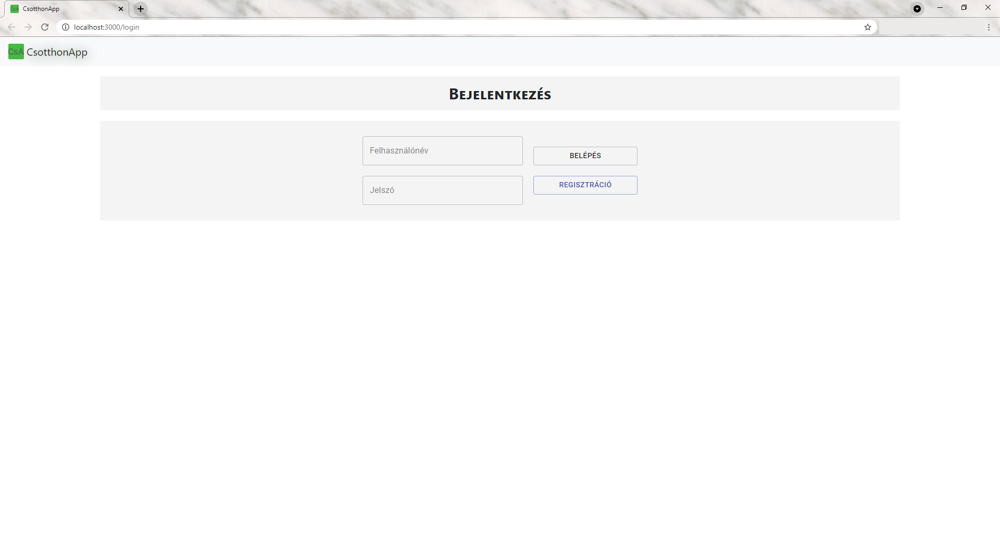
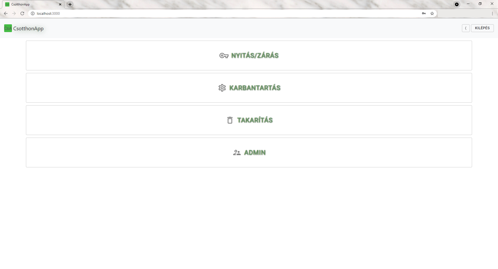
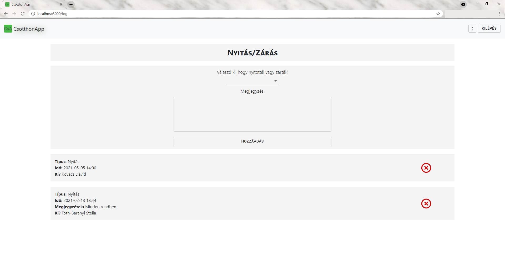

# Szakdolgozat és önálló laboratórium - CsotthonApp
## Introduction
This project was created for my Thesis Project and Project Laboratory course at BME (my university). I am a scout at a Hungarian scout team, where I am also a leader. Every scout team usually has a place where their events can take palce (in Hungarian this place's name is cserkészotthon and in free translation: scout home). Because this place is not our property, we have to clean it, log when someone opened or closed it and something is out of stock then indicate it to someone.

We used to do these things on paper that is why I started to create this app. The backend stores the data on a MySQL database and it runs on Spring Boot framework. The frontend uses the React JS libraries but currently not the cleanest code because I started to learn JavaScript, HTML, CSS and React within this project.

The project now can log the closes and openings, the cleanings and the maintenances and it also has authentication and authorization (who has admin rights can delete entities and has access to the admin page). Currently who registers as an *Őrsvezető* (scout leader) in the register page has an admin right.

## Current status
### Mobile:
   

### Desktop:
   

#### You can find more screenshots in the *.../imgs* folder

## Getting Started

### With the provided batch files:

Open command line, then:

##### (These install the backend and the frontend)
```
install_backend.bat
install_frontend.bat
```

Then:
##### (These start the backend and the frontend)
```
start_backend.bat
start_frontend.bat
```

### Or manually:

### I. Set up database and schema access
The application uses a MySQL database, that you have to set up. You can use either **MySQL Workbench** or any other client (e.g. **JetBrains DataGrip**) you can edit the database transactions:

 1. The root username and password has to be: root (or you can change these in the *src/main/java/resources/application.properties*)
 2. Create the schema wich has to be: csotthonapp
 3. Go to the [*Installing and running the backend*](#Installing-and-running-the-backend) part
 4. After `mvn install` you have to `drop` the schema and `create` it again or just `drop` all the tables one by one 

### II. Installing and running the backend

```
mvn clean install
```

Then

```
mvn spring-boot:run
```

### III. Installing and running the frontend

Go to the *src/main/webapp* folder, then:
```
npm install
```

Then

```
npm start
```

## Currently bulit-in credentials
The text you have to use is **inside** the square bracket [].
|Username  |Password  |Role(s)        |
|:--------:|:--------:|:-------------:|
|[stellasipi]   |[password1]   |ADMIN, USER |
|[dadikovi]     |[password2]   |ADMIN       |

## Built With
* [Spring Boot](https://spring.io/projects/spring-boot) 
* [React](https://reactjs.org/) 
## Author

 **Stella Tóth-Baranyi**
